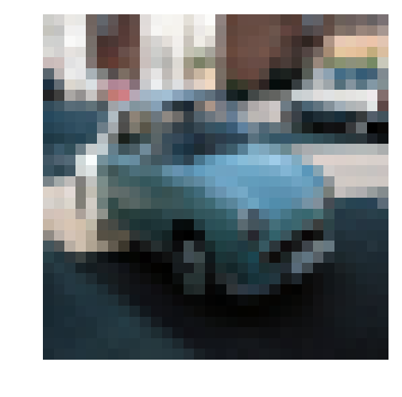
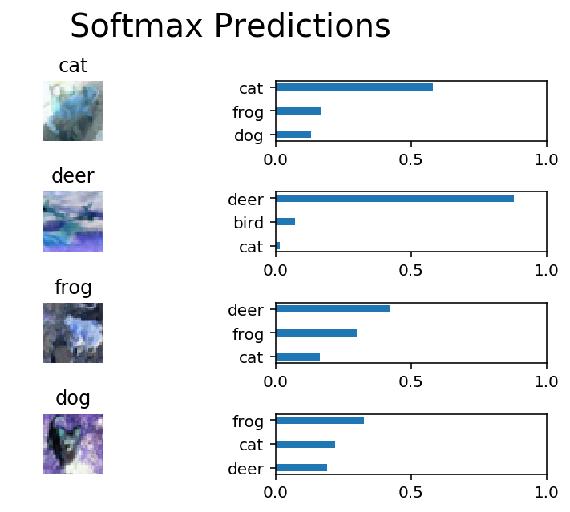

# Image Classification
In this project, you'll classify images from the [CIFAR-10 dataset](https://www.cs.toronto.edu/~kriz/cifar.html).  The dataset consists of airplanes, dogs, cats, and other objects. You'll preprocess the images, then train a convolutional neural network on all the samples. The images need to be normalized and the labels need to be one-hot encoded.  You'll get to apply what you learned and build a convolutional, max pooling, dropout, and fully connected layers.  At the end, you'll get to see your neural network's predictions on the sample images.
## Get the Data
Run the following cell to download the [CIFAR-10 dataset for python](https://www.cs.toronto.edu/~kriz/cifar-10-python.tar.gz).


```python
"""
DON'T MODIFY ANYTHING IN THIS CELL THAT IS BELOW THIS LINE
"""
from urllib.request import urlretrieve
from os.path import isfile, isdir
from tqdm import tqdm
import problem_unittests as tests
import tarfile

cifar10_dataset_folder_path = 'cifar-10-batches-py'

class DLProgress(tqdm):
    last_block = 0

    def hook(self, block_num=1, block_size=1, total_size=None):
        self.total = total_size
        self.update((block_num - self.last_block) * block_size)
        self.last_block = block_num

if not isfile('cifar-10-python.tar.gz'):
    with DLProgress(unit='B', unit_scale=True, miniters=1, desc='CIFAR-10 Dataset') as pbar:
        urlretrieve(
            'https://www.cs.toronto.edu/~kriz/cifar-10-python.tar.gz',
            'cifar-10-python.tar.gz',
            pbar.hook)

if not isdir(cifar10_dataset_folder_path):
    with tarfile.open('cifar-10-python.tar.gz') as tar:
        tar.extractall()
        tar.close()


tests.test_folder_path(cifar10_dataset_folder_path)
```

    All files found!


## Explore the Data
The dataset is broken into batches to prevent your machine from running out of memory.  The CIFAR-10 dataset consists of 5 batches, named `data_batch_1`, `data_batch_2`, etc.. Each batch contains the labels and images that are one of the following:
* airplane
* automobile
* bird
* cat
* deer
* dog
* frog
* horse
* ship
* truck

Understanding a dataset is part of making predictions on the data.  Play around with the code cell below by changing the `batch_id` and `sample_id`. The `batch_id` is the id for a batch (1-5). The `sample_id` is the id for a image and label pair in the batch.

Ask yourself "What are all possible labels?", "What is the range of values for the image data?", "Are the labels in order or random?".  Answers to questions like these will help you preprocess the data and end up with better predictions.


```python
%matplotlib inline
%config InlineBackend.figure_format = 'retina'

import helper
import numpy as np

# Explore the dataset
batch_id = 5
sample_id = 3
helper.display_stats(cifar10_dataset_folder_path, batch_id, sample_id)
```

    
    Stats of batch 5:
    Samples: 10000
    Label Counts: {0: 1014, 1: 1014, 2: 952, 3: 1016, 4: 997, 5: 1025, 6: 980, 7: 977, 8: 1003, 9: 1022}
    First 20 Labels: [1, 8, 5, 1, 5, 7, 4, 3, 8, 2, 7, 2, 0, 1, 5, 9, 6, 2, 0, 8]
    
    Example of Image 3:
    Image - Min Value: 0 Max Value: 252
    Image - Shape: (32, 32, 3)
    Label - Label Id: 1 Name: automobile





## Implement Preprocess Functions
### Normalize
In the cell below, implement the `normalize` function to take in image data, `x`, and return it as a normalized Numpy array. The values should be in the range of 0 to 1, inclusive.  The return object should be the same shape as `x`.


```python
def normalize(x):
    """
    Normalize a list of sample image data in the range of 0 to 1
    : x: List of image data.  The image shape is (32, 32, 3)
    : return: Numpy array of normalize data
    """
    a = 1
    b = 0
    greyscale_min = 0
    greyscale_max = 255
    output = a + ( ( (x - greyscale_min)*(b - a) )/( greyscale_max - greyscale_min ) )
    return output


"""
DON'T MODIFY ANYTHING IN THIS CELL THAT IS BELOW THIS LINE
"""
tests.test_normalize(normalize)
```

    Tests Passed


### One-hot encode
Just like the previous code cell, you'll be implementing a function for preprocessing.  This time, you'll implement the `one_hot_encode` function. The input, `x`, are a list of labels.  Implement the function to return the list of labels as One-Hot encoded Numpy array.  The possible values for labels are 0 to 9. The one-hot encoding function should return the same encoding for each value between each call to `one_hot_encode`.  Make sure to save the map of encodings outside the function.

Hint: Don't reinvent the wheel.


```python

def one_hot_encode(x):
    """
    One hot encode a list of sample labels. Return a one-hot encoded vector for each label.
    : x: List of sample Labels
    : return: Numpy array of one-hot encoded labels
    """
    ohe_x = []
    for idx,label in enumerate(x):
        ohe_x.append(np.zeros(10))
        ohe_x[idx][label] = 1
    
    ohe_x = np.array(ohe_x)
    return ohe_x


"""
DON'T MODIFY ANYTHING IN THIS CELL THAT IS BELOW THIS LINE
"""
tests.test_one_hot_encode(one_hot_encode)
```

    Tests Passed


### Randomize Data
As you saw from exploring the data above, the order of the samples are randomized.  It doesn't hurt to randomize it again, but you don't need to for this dataset.

## Preprocess all the data and save it
Running the code cell below will preprocess all the CIFAR-10 data and save it to file. The code below also uses 10% of the training data for validation.


```python
"""
DON'T MODIFY ANYTHING IN THIS CELL
"""
# Preprocess Training, Validation, and Testing Data
helper.preprocess_and_save_data(cifar10_dataset_folder_path, normalize, one_hot_encode)
```

# Check Point
This is your first checkpoint.  If you ever decide to come back to this notebook or have to restart the notebook, you can start from here.  The preprocessed data has been saved to disk.


```python
"""
DON'T MODIFY ANYTHING IN THIS CELL
"""
import pickle
import problem_unittests as tests
import helper

# Load the Preprocessed Validation data
valid_features, valid_labels = pickle.load(open('preprocess_validation.p', mode='rb'))
```

## Build the network
For the neural network, you'll build each layer into a function.  Most of the code you've seen has been outside of functions. To test your code more thoroughly, we require that you put each layer in a function.  This allows us to give you better feedback and test for simple mistakes using our unittests before you submit your project.

>**Note:** If you're finding it hard to dedicate enough time for this course each week, we've provided a small shortcut to this part of the project. In the next couple of problems, you'll have the option to use classes from the [TensorFlow Layers](https://www.tensorflow.org/api_docs/python/tf/layers) or [TensorFlow Layers (contrib)](https://www.tensorflow.org/api_guides/python/contrib.layers) packages to build each layer, except the layers you build in the "Convolutional and Max Pooling Layer" section.  TF Layers is similar to Keras's and TFLearn's abstraction to layers, so it's easy to pickup.

>However, if you would like to get the most out of this course, try to solve all the problems _without_ using anything from the TF Layers packages. You **can** still use classes from other packages that happen to have the same name as ones you find in TF Layers! For example, instead of using the TF Layers version of the `conv2d` class, [tf.layers.conv2d](https://www.tensorflow.org/api_docs/python/tf/layers/conv2d), you would want to use the TF Neural Network version of `conv2d`, [tf.nn.conv2d](https://www.tensorflow.org/api_docs/python/tf/nn/conv2d). 

Let's begin!

### Input
The neural network needs to read the image data, one-hot encoded labels, and dropout keep probability. Implement the following functions
* Implement `neural_net_image_input`
 * Return a [TF Placeholder](https://www.tensorflow.org/api_docs/python/tf/placeholder)
 * Set the shape using `image_shape` with batch size set to `None`.
 * Name the TensorFlow placeholder "x" using the TensorFlow `name` parameter in the [TF Placeholder](https://www.tensorflow.org/api_docs/python/tf/placeholder).
* Implement `neural_net_label_input`
 * Return a [TF Placeholder](https://www.tensorflow.org/api_docs/python/tf/placeholder)
 * Set the shape using `n_classes` with batch size set to `None`.
 * Name the TensorFlow placeholder "y" using the TensorFlow `name` parameter in the [TF Placeholder](https://www.tensorflow.org/api_docs/python/tf/placeholder).
* Implement `neural_net_keep_prob_input`
 * Return a [TF Placeholder](https://www.tensorflow.org/api_docs/python/tf/placeholder) for dropout keep probability.
 * Name the TensorFlow placeholder "keep_prob" using the TensorFlow `name` parameter in the [TF Placeholder](https://www.tensorflow.org/api_docs/python/tf/placeholder).

These names will be used at the end of the project to load your saved model.

Note: `None` for shapes in TensorFlow allow for a dynamic size.


```python
import tensorflow as tf

def neural_net_image_input(image_shape):
    """
    Return a Tensor for a bach of image input
    : image_shape: Shape of the images
    : return: Tensor for image input.
    """
    x = tf.placeholder(tf.float32, [None, image_shape[0],image_shape[1],image_shape[2] ], name='x')
    return x


def neural_net_label_input(n_classes):
    """
    Return a Tensor for a batch of label input
    : n_classes: Number of classes
    : return: Tensor for label input.
    """
    y = tf.placeholder(tf.float32, [None,10], name='y')
    return y


def neural_net_keep_prob_input():
    """
    Return a Tensor for keep probability
    : return: Tensor for keep probability.
    """
    keep_prob = tf.placeholder(tf.float32, name='keep_prob')
    return keep_prob


"""
DON'T MODIFY ANYTHING IN THIS CELL THAT IS BELOW THIS LINE
"""
tf.reset_default_graph()
tests.test_nn_image_inputs(neural_net_image_input)
tests.test_nn_label_inputs(neural_net_label_input)
tests.test_nn_keep_prob_inputs(neural_net_keep_prob_input)
```

    Image Input Tests Passed.
    Label Input Tests Passed.
    Keep Prob Tests Passed.


### Convolution and Max Pooling Layer
Convolution layers have a lot of success with images. For this code cell, you should implement the function `conv2d_maxpool` to apply convolution then max pooling:
* Create the weight and bias using `conv_ksize`, `conv_num_outputs` and the shape of `x_tensor`.
* Apply a convolution to `x_tensor` using weight and `conv_strides`.
 * We recommend you use same padding, but you're welcome to use any padding.
* Add bias
* Add a nonlinear activation to the convolution.
* Apply Max Pooling using `pool_ksize` and `pool_strides`.
 * We recommend you use same padding, but you're welcome to use any padding.

**Note:** You **can't** use [TensorFlow Layers](https://www.tensorflow.org/api_docs/python/tf/layers) or [TensorFlow Layers (contrib)](https://www.tensorflow.org/api_guides/python/contrib.layers) for **this** layer, but you can still use TensorFlow's [Neural Network](https://www.tensorflow.org/api_docs/python/tf/nn) package. You may still use the shortcut option for all the **other** layers.


```python
def conv2d_maxpool(x_tensor, conv_num_outputs, conv_ksize, conv_strides, pool_ksize, pool_strides):
    """
    Apply convolution then max pooling to x_tensor
    :param x_tensor: TensorFlow Tensor
    :param conv_num_outputs: Number of outputs for the convolutional layer
    :param conv_ksize: kernal size 2-D Tuple for the convolutional layer
    :param conv_strides: Stride 2-D Tuple for convolution
    :param pool_ksize: kernal size 2-D Tuple for pool
    :param pool_strides: Stride 2-D Tuple for pool
    : return: A tensor that represents convolution and max pooling of x_tensor
    """
    shape = x_tensor.get_shape().as_list()
    input_channels = shape[3]
   
    s = [conv_ksize[0], conv_ksize[1], input_channels, conv_num_outputs]
    weight = tf.Variable(tf.truncated_normal(s, stddev=0.05, mean=0.0))
    bias = tf.Variable(tf.constant(0.01, tf.float32, [conv_num_outputs]))
   
    conv_layer = tf.nn.relu(tf.nn.conv2d(x_tensor, weight, strides=[1, conv_strides[0], conv_strides[1],1 ], padding='SAME') + bias)
   
    pool_layer = tf.nn.max_pool(conv_layer, ksize=[1,pool_ksize[0],pool_ksize[1],1], strides=[1,pool_strides[0],pool_strides[1],1], padding='SAME')
    return pool_layer 

"""
DON'T MODIFY ANYTHING IN THIS CELL THAT IS BELOW THIS LINE
"""
tests.test_con_pool(conv2d_maxpool)
```

    Tests Passed


### Flatten Layer
Implement the `flatten` function to change the dimension of `x_tensor` from a 4-D tensor to a 2-D tensor.  The output should be the shape (*Batch Size*, *Flattened Image Size*). Shortcut option: you can use classes from the [TensorFlow Layers](https://www.tensorflow.org/api_docs/python/tf/layers) or [TensorFlow Layers (contrib)](https://www.tensorflow.org/api_guides/python/contrib.layers) packages for this layer. For more of a challenge, only use other TensorFlow packages.


```python
def flatten(x_tensor):
    """
    Flatten x_tensor to (Batch Size, Flattened Image Size)
    : x_tensor: A tensor of size (Batch Size, ...), where ... are the image dimensions.
    : return: A tensor of size (Batch Size, Flattened Image Size).
    """
    shape = x_tensor.get_shape()
    num_features = shape[1:4].num_elements()
    flattened = tf.reshape(x_tensor, [-1,num_features])
    return flattened


"""
DON'T MODIFY ANYTHING IN THIS CELL THAT IS BELOW THIS LINE
"""
tests.test_flatten(flatten)
```

    Tests Passed


### Fully-Connected Layer
Implement the `fully_conn` function to apply a fully connected layer to `x_tensor` with the shape (*Batch Size*, *num_outputs*). Shortcut option: you can use classes from the [TensorFlow Layers](https://www.tensorflow.org/api_docs/python/tf/layers) or [TensorFlow Layers (contrib)](https://www.tensorflow.org/api_guides/python/contrib.layers) packages for this layer. For more of a challenge, only use other TensorFlow packages.


```python
def fully_conn(x_tensor, num_outputs):
    """
    Apply a fully connected layer to x_tensor using weight and bias
    : x_tensor: A 2-D tensor where the first dimension is batch size.
    : num_outputs: The number of output that the new tensor should be.
    : return: A 2-D tensor where the second dimension is num_outputs.
    """
    shape = x_tensor.get_shape().as_list()
  
    weight2 = tf.Variable(tf.truncated_normal([shape[1], num_outputs], stddev=0.05, mean=0.0))
    bias2 = tf.Variable(tf.constant(0.01, tf.float32, [num_outputs]))
    
    fc_layer = tf.matmul(x_tensor, weight2) + bias2
    return tf.nn.relu(fc_layer)


"""
DON'T MODIFY ANYTHING IN THIS CELL THAT IS BELOW THIS LINE
"""
tests.test_fully_conn(fully_conn)
```

    Tests Passed


### Output Layer
Implement the `output` function to apply a fully connected layer to `x_tensor` with the shape (*Batch Size*, *num_outputs*). Shortcut option: you can use classes from the [TensorFlow Layers](https://www.tensorflow.org/api_docs/python/tf/layers) or [TensorFlow Layers (contrib)](https://www.tensorflow.org/api_guides/python/contrib.layers) packages for this layer. For more of a challenge, only use other TensorFlow packages.

**Note:** Activation, softmax, or cross entropy should **not** be applied to this.


```python
def output(x_tensor, num_outputs):
    """
    Apply a output layer to x_tensor using weight and bias
    : x_tensor: A 2-D tensor where the first dimension is batch size.
    : num_outputs: The number of output that the new tensor should be.
    : return: A 2-D tensor where the second dimension is num_outputs.
    """
    shape = x_tensor.get_shape().as_list()
    
    weight3 = tf.Variable(tf.truncated_normal([shape[1], num_outputs], stddev=0.1))
    bias3 = tf.Variable(tf.constant(0.01, tf.float32, [num_outputs]))
    
    output_layer =  tf.matmul(x_tensor, weight3) + bias3
    return output_layer


"""
DON'T MODIFY ANYTHING IN THIS CELL THAT IS BELOW THIS LINE
"""
tests.test_output(output)
```

    Tests Passed


### Create Convolutional Model
Implement the function `conv_net` to create a convolutional neural network model. The function takes in a batch of images, `x`, and outputs logits.  Use the layers you created above to create this model:

* Apply 1, 2, or 3 Convolution and Max Pool layers
* Apply a Flatten Layer
* Apply 1, 2, or 3 Fully Connected Layers
* Apply an Output Layer
* Return the output
* Apply [TensorFlow's Dropout](https://www.tensorflow.org/api_docs/python/tf/nn/dropout) to one or more layers in the model using `keep_prob`. 


```python
def conv_net(x, keep_prob):
    """
    Create a convolutional neural network model
    : x: Placeholder tensor that holds image data.
    : keep_prob: Placeholder tensor that hold dropout keep probability.
    : return: Tensor that represents logits
    """
    # TODO: Apply 1, 2, or 3 Convolution and Max Pool layers
    #    Play around with different number of outputs, kernel size and stride
    # Function Definition from Above:
    # def conv2d_maxpool(x_tensor, conv_num_outputs, conv_ksize, conv_strides, pool_ksize, pool_strides):
    k = conv2d_maxpool(x, 32, (5,5), (1,1), (2,2), (2,2))
    l = conv2d_maxpool(k, 64, (4,4), (1,1), (2,2), (2,2))
    m = conv2d_maxpool(l, 128, (4,4), (1,1), (2,2), (2,2))
    

    # TODO: Apply a Flatten Layer
    # Function Definition from Above:
    n = flatten(m)
    o = tf.nn.dropout(n, keep_prob)
    

    # TODO: Apply 1, 2, or 3 Fully Connected Layers
    #    Play around with different number of outputs
    # Function Definition from Above:
    p = fully_conn(o, 512)
#     q = tf.nn.dropout(o, keep_prob)
    r = fully_conn(p, 50)

    #p = fully_conn(o, 256)
    #tf.nn.dropout(p, keep_prob)
    #q = fully_conn(p, 50)
    
    
    # TODO: Apply an Output Layer
    #    Set this to the number of classes
    # Function Definition from Above:
    t = output(r, 10)
    
    
    # TODO: return output
    return t


"""
DON'T MODIFY ANYTHING IN THIS CELL THAT IS BELOW THIS LINE
"""

##############################
## Build the Neural Network ##
##############################

# Remove previous weights, bias, inputs, etc..
tf.reset_default_graph()

# Inputs
x = neural_net_image_input((32, 32, 3))
y = neural_net_label_input(10)
keep_prob = neural_net_keep_prob_input()

# Model
logits = conv_net(x, keep_prob)

# Name logits Tensor, so that is can be loaded from disk after training
logits = tf.identity(logits, name='logits')

# Loss and Optimizer
cost = tf.reduce_mean(tf.nn.softmax_cross_entropy_with_logits(logits=logits, labels=y))
optimizer = tf.train.AdamOptimizer(1e-4).minimize(cost)

# Accuracy
correct_pred = tf.equal(tf.argmax(logits, 1), tf.argmax(y, 1))
accuracy = tf.reduce_mean(tf.cast(correct_pred, tf.float32), name='accuracy')

tests.test_conv_net(conv_net)
```

    Neural Network Built!


## Train the Neural Network
### Single Optimization
Implement the function `train_neural_network` to do a single optimization.  The optimization should use `optimizer` to optimize in `session` with a `feed_dict` of the following:
* `x` for image input
* `y` for labels
* `keep_prob` for keep probability for dropout

This function will be called for each batch, so `tf.global_variables_initializer()` has already been called.

Note: Nothing needs to be returned. This function is only optimizing the neural network.


```python
def train_neural_network(session, optimizer, keep_probability, feature_batch, label_batch):
    """
    Optimize the session on a batch of images and labels
    : session: Current TensorFlow session
    : optimizer: TensorFlow optimizer function
    : keep_probability: keep probability
    : feature_batch: Batch of Numpy image data
    : label_batch: Batch of Numpy label data
    """
    
    feed_dict_train = {x: feature_batch,
                           y: label_batch,
                           keep_prob: keep_probability}
    session.run(optimizer, feed_dict=feed_dict_train)
    pass


"""
DON'T MODIFY ANYTHING IN THIS CELL THAT IS BELOW THIS LINE
"""
tests.test_train_nn(train_neural_network)
```

    Tests Passed


### Show Stats
Implement the function `print_stats` to print loss and validation accuracy.  Use the global variables `valid_features` and `valid_labels` to calculate validation accuracy.  Use a keep probability of `1.0` to calculate the loss and validation accuracy.


```python
def print_stats(session, feature_batch, label_batch, cost, accuracy):
    """
    Print information about loss and validation accuracy
    : session: Current TensorFlow session
    : feature_batch: Batch of Numpy image data
    : label_batch: Batch of Numpy label data
    : cost: TensorFlow cost function
    : accuracy: TensorFlow accuracy function
    """
    global valid_features
    global valid_labels
    
    feed_dict_test = {x: feature_batch,
                           y: label_batch,
                           keep_prob: 1.0}
    a,c = session.run([accuracy,cost], feed_dict=feed_dict_test)
    print('\nTraining Accuracy: ',a)
    print('Training Cost: ' ,c)
    feed_dict_valid = {x: valid_features,
                           y: valid_labels,
                           keep_prob: 1.0}
    va,vc = session.run([accuracy,cost], feed_dict=feed_dict_valid)
    print('Validation Accuracy: ',va)
    print('Validation Cost: ' ,vc)
    pass
```

### Hyperparameters
Tune the following parameters:
* Set `epochs` to the number of iterations until the network stops learning or start overfitting
* Set `batch_size` to the highest number that your machine has memory for.  Most people set them to common sizes of memory:
 * 64
 * 128
 * 256
 * ...
* Set `keep_probability` to the probability of keeping a node using dropout


```python
# TODO: Tune Parameters
epochs = 10
batch_size = 8
keep_probability = 0.25
```

### Train on a Single CIFAR-10 Batch
Instead of training the neural network on all the CIFAR-10 batches of data, let's use a single batch. This should save time while you iterate on the model to get a better accuracy.  Once the final validation accuracy is 50% or greater, run the model on all the data in the next section.


```python
"""
DON'T MODIFY ANYTHING IN THIS CELL
"""
print('Checking the Training on a Single Batch...')
with tf.Session() as sess:
    # Initializing the variables
    sess.run(tf.global_variables_initializer())
    
    # Training cycle
    for epoch in range(epochs):
        batch_i = 1
        for batch_features, batch_labels in helper.load_preprocess_training_batch(batch_i, batch_size):
            train_neural_network(sess, optimizer, keep_probability, batch_features, batch_labels)
        print('Epoch {:>2}, CIFAR-10 Batch {}:  '.format(epoch + 1, batch_i), end='')
        print_stats(sess, batch_features, batch_labels, cost, accuracy)
```

    Checking the Training on a Single Batch...
    Epoch  1, CIFAR-10 Batch 1:  
    Training Accuracy:  0.375
    Training Cost:  1.66624
    Validation Accuracy:  0.275
    Validation Cost:  1.9401
    Epoch  2, CIFAR-10 Batch 1:  
    Training Accuracy:  0.5
    Training Cost:  1.45526
    Validation Accuracy:  0.383
    Validation Cost:  1.69666
    Epoch  3, CIFAR-10 Batch 1:  
    Training Accuracy:  0.375
    Training Cost:  1.37761
    Validation Accuracy:  0.432
    Validation Cost:  1.55396
    Epoch  4, CIFAR-10 Batch 1:  
    Training Accuracy:  0.5
    Training Cost:  1.34489
    Validation Accuracy:  0.4588
    Validation Cost:  1.49036
    Epoch  5, CIFAR-10 Batch 1:  
    Training Accuracy:  0.5
    Training Cost:  1.3474
    Validation Accuracy:  0.478
    Validation Cost:  1.42916
    Epoch  6, CIFAR-10 Batch 1:  
    Training Accuracy:  0.5
    Training Cost:  1.38158
    Validation Accuracy:  0.4958
    Validation Cost:  1.40113
    Epoch  7, CIFAR-10 Batch 1:  
    Training Accuracy:  0.625
    Training Cost:  1.32085
    Validation Accuracy:  0.507
    Validation Cost:  1.36216
    Epoch  8, CIFAR-10 Batch 1:  
    Training Accuracy:  0.625
    Training Cost:  1.33066
    Validation Accuracy:  0.5216
    Validation Cost:  1.33063
    Epoch  9, CIFAR-10 Batch 1:  
    Training Accuracy:  0.625
    Training Cost:  1.30207
    Validation Accuracy:  0.5382
    Validation Cost:  1.29451
    Epoch 10, CIFAR-10 Batch 1:  
    Training Accuracy:  0.75
    Training Cost:  1.28085
    Validation Accuracy:  0.5414
    Validation Cost:  1.28074


### Fully Train the Model
Now that you got a good accuracy with a single CIFAR-10 batch, try it with all five batches.


```python
"""
DON'T MODIFY ANYTHING IN THIS CELL
"""
save_model_path = './image_classification'

print('Training...')
with tf.Session() as sess:
    # Initializing the variables
    sess.run(tf.global_variables_initializer())
    
    # Training cycle
    for epoch in range(epochs):
        # Loop over all batches
        n_batches = 5
        for batch_i in range(1, n_batches + 1):
            for batch_features, batch_labels in helper.load_preprocess_training_batch(batch_i, batch_size):
                train_neural_network(sess, optimizer, keep_probability, batch_features, batch_labels)
            print('Epoch {:>2}, CIFAR-10 Batch {}:  '.format(epoch + 1, batch_i), end='')
            print_stats(sess, batch_features, batch_labels, cost, accuracy)
            
    # Save Model
    saver = tf.train.Saver()
    save_path = saver.save(sess, save_model_path)
```

    Training...
    Epoch  1, CIFAR-10 Batch 1:  
    Training Accuracy:  0.375
    Training Cost:  1.71526
    Validation Accuracy:  0.2768
    Validation Cost:  1.92033
    Epoch  1, CIFAR-10 Batch 2:  
    Training Accuracy:  0.25
    Training Cost:  1.8568
    Validation Accuracy:  0.3564
    Validation Cost:  1.73134
    Epoch  1, CIFAR-10 Batch 3:  
    Training Accuracy:  0.5
    Training Cost:  1.27314
    Validation Accuracy:  0.408
    Validation Cost:  1.58428
    Epoch  1, CIFAR-10 Batch 4:  
    Training Accuracy:  0.25
    Training Cost:  1.74556
    Validation Accuracy:  0.4476
    Validation Cost:  1.49885
    Epoch  1, CIFAR-10 Batch 5:  
    Training Accuracy:  0.25
    Training Cost:  1.79484
    Validation Accuracy:  0.47
    Validation Cost:  1.44961
    Epoch  2, CIFAR-10 Batch 1:  
    Training Accuracy:  0.625
    Training Cost:  1.30369
    Validation Accuracy:  0.4926
    Validation Cost:  1.40561
    Epoch  2, CIFAR-10 Batch 2:  
    Training Accuracy:  0.375
    Training Cost:  1.59937
    Validation Accuracy:  0.4508
    Validation Cost:  1.49658
    Epoch  2, CIFAR-10 Batch 3:  
    Training Accuracy:  0.625
    Training Cost:  1.06555
    Validation Accuracy:  0.5132
    Validation Cost:  1.33131
    Epoch  2, CIFAR-10 Batch 4:  
    Training Accuracy:  0.375
    Training Cost:  1.35905
    Validation Accuracy:  0.5272
    Validation Cost:  1.30397
    Epoch  2, CIFAR-10 Batch 5:  
    Training Accuracy:  0.625
    Training Cost:  1.6646
    Validation Accuracy:  0.5416
    Validation Cost:  1.2734
    Epoch  3, CIFAR-10 Batch 1:  
    Training Accuracy:  0.625
    Training Cost:  1.35288
    Validation Accuracy:  0.5546
    Validation Cost:  1.24636
    Epoch  3, CIFAR-10 Batch 2:  
    Training Accuracy:  0.375
    Training Cost:  1.3682
    Validation Accuracy:  0.5144
    Validation Cost:  1.334
    Epoch  3, CIFAR-10 Batch 3:  
    Training Accuracy:  0.625
    Training Cost:  0.977565
    Validation Accuracy:  0.5632
    Validation Cost:  1.20478
    Epoch  3, CIFAR-10 Batch 4:  
    Training Accuracy:  0.5
    Training Cost:  1.21123
    Validation Accuracy:  0.567
    Validation Cost:  1.19341
    Epoch  3, CIFAR-10 Batch 5:  
    Training Accuracy:  0.625
    Training Cost:  1.532
    Validation Accuracy:  0.578
    Validation Cost:  1.1671
    Epoch  4, CIFAR-10 Batch 1:  
    Training Accuracy:  0.625
    Training Cost:  1.29728
    Validation Accuracy:  0.586
    Validation Cost:  1.14752
    Epoch  4, CIFAR-10 Batch 2:  
    Training Accuracy:  0.5
    Training Cost:  1.04906
    Validation Accuracy:  0.5722
    Validation Cost:  1.19603
    Epoch  4, CIFAR-10 Batch 3:  
    Training Accuracy:  0.75
    Training Cost:  0.892571
    Validation Accuracy:  0.6026
    Validation Cost:  1.1066
    Epoch  4, CIFAR-10 Batch 4:  
    Training Accuracy:  0.375
    Training Cost:  1.15794
    Validation Accuracy:  0.6008
    Validation Cost:  1.10459
    Epoch  4, CIFAR-10 Batch 5:  
    Training Accuracy:  0.5
    Training Cost:  1.57312
    Validation Accuracy:  0.601
    Validation Cost:  1.09847
    Epoch  5, CIFAR-10 Batch 1:  
    Training Accuracy:  0.625
    Training Cost:  1.14057
    Validation Accuracy:  0.6184
    Validation Cost:  1.07201
    Epoch  5, CIFAR-10 Batch 2:  
    Training Accuracy:  0.75
    Training Cost:  0.863773
    Validation Accuracy:  0.6114
    Validation Cost:  1.09477
    Epoch  5, CIFAR-10 Batch 3:  
    Training Accuracy:  0.75
    Training Cost:  0.809269
    Validation Accuracy:  0.625
    Validation Cost:  1.04717
    Epoch  5, CIFAR-10 Batch 4:  
    Training Accuracy:  0.5
    Training Cost:  1.19065
    Validation Accuracy:  0.6284
    Validation Cost:  1.042
    Epoch  5, CIFAR-10 Batch 5:  
    Training Accuracy:  0.625
    Training Cost:  1.44225
    Validation Accuracy:  0.6328
    Validation Cost:  1.02093
    Epoch  6, CIFAR-10 Batch 1:  
    Training Accuracy:  0.625
    Training Cost:  1.08509
    Validation Accuracy:  0.6368
    Validation Cost:  1.03068
    Epoch  6, CIFAR-10 Batch 2:  
    Training Accuracy:  0.75
    Training Cost:  0.73836
    Validation Accuracy:  0.6426
    Validation Cost:  1.004
    Epoch  6, CIFAR-10 Batch 3:  
    Training Accuracy:  0.875
    Training Cost:  0.725209
    Validation Accuracy:  0.6476
    Validation Cost:  0.988569
    Epoch  6, CIFAR-10 Batch 4:  
    Training Accuracy:  0.375
    Training Cost:  1.22157
    Validation Accuracy:  0.6434
    Validation Cost:  1.00388
    Epoch  6, CIFAR-10 Batch 5:  
    Training Accuracy:  0.5
    Training Cost:  1.36685
    Validation Accuracy:  0.6604
    Validation Cost:  0.968926
    Epoch  7, CIFAR-10 Batch 1:  
    Training Accuracy:  0.625
    Training Cost:  1.00784
    Validation Accuracy:  0.6594
    Validation Cost:  0.972436
    Epoch  7, CIFAR-10 Batch 2:  
    Training Accuracy:  0.75
    Training Cost:  0.646791
    Validation Accuracy:  0.636
    Validation Cost:  1.04145
    Epoch  7, CIFAR-10 Batch 3:  
    Training Accuracy:  0.875
    Training Cost:  0.809236
    Validation Accuracy:  0.6548
    Validation Cost:  0.973661
    Epoch  7, CIFAR-10 Batch 4:  
    Training Accuracy:  0.75
    Training Cost:  0.989226
    Validation Accuracy:  0.661
    Validation Cost:  0.961633
    Epoch  7, CIFAR-10 Batch 5:  
    Training Accuracy:  0.5
    Training Cost:  1.23975
    Validation Accuracy:  0.6776
    Validation Cost:  0.920906
    Epoch  8, CIFAR-10 Batch 1:  
    Training Accuracy:  0.625
    Training Cost:  0.965239
    Validation Accuracy:  0.6734
    Validation Cost:  0.919227
    Epoch  8, CIFAR-10 Batch 2:  
    Training Accuracy:  0.875
    Training Cost:  0.592967
    Validation Accuracy:  0.6716
    Validation Cost:  0.936392
    Epoch  8, CIFAR-10 Batch 3:  
    Training Accuracy:  0.75
    Training Cost:  0.714441
    Validation Accuracy:  0.6822
    Validation Cost:  0.897387
    Epoch  8, CIFAR-10 Batch 4:  
    Training Accuracy:  0.625
    Training Cost:  1.0069
    Validation Accuracy:  0.6872
    Validation Cost:  0.893442
    Epoch  8, CIFAR-10 Batch 5:  
    Training Accuracy:  0.375
    Training Cost:  1.3392
    Validation Accuracy:  0.6756
    Validation Cost:  0.918012
    Epoch  9, CIFAR-10 Batch 1:  
    Training Accuracy:  0.625
    Training Cost:  0.855529
    Validation Accuracy:  0.6902
    Validation Cost:  0.888263
    Epoch  9, CIFAR-10 Batch 2:  
    Training Accuracy:  0.75
    Training Cost:  0.562512
    Validation Accuracy:  0.6842
    Validation Cost:  0.898722
    Epoch  9, CIFAR-10 Batch 3:  
    Training Accuracy:  0.875
    Training Cost:  0.555599
    Validation Accuracy:  0.6946
    Validation Cost:  0.865276
    Epoch  9, CIFAR-10 Batch 4:  
    Training Accuracy:  0.625
    Training Cost:  0.9513
    Validation Accuracy:  0.696
    Validation Cost:  0.865924
    Epoch  9, CIFAR-10 Batch 5:  
    Training Accuracy:  0.625
    Training Cost:  1.20284
    Validation Accuracy:  0.683
    Validation Cost:  0.900452
    Epoch 10, CIFAR-10 Batch 1:  
    Training Accuracy:  0.625
    Training Cost:  0.811815
    Validation Accuracy:  0.7034
    Validation Cost:  0.853281
    Epoch 10, CIFAR-10 Batch 2:  
    Training Accuracy:  0.75
    Training Cost:  0.535571
    Validation Accuracy:  0.6986
    Validation Cost:  0.86171
    Epoch 10, CIFAR-10 Batch 3:  
    Training Accuracy:  0.875
    Training Cost:  0.60727
    Validation Accuracy:  0.7034
    Validation Cost:  0.839756
    Epoch 10, CIFAR-10 Batch 4:  
    Training Accuracy:  0.625
    Training Cost:  0.881466
    Validation Accuracy:  0.7044
    Validation Cost:  0.850327
    Epoch 10, CIFAR-10 Batch 5:  
    Training Accuracy:  0.625
    Training Cost:  1.20349
    Validation Accuracy:  0.711
    Validation Cost:  0.834748


# Checkpoint
The model has been saved to disk.
## Test Model
Test your model against the test dataset.  This will be your final accuracy. You should have an accuracy greater than 50%. If you don't, keep tweaking the model architecture and parameters.


```python
"""
DON'T MODIFY ANYTHING IN THIS CELL
"""
%matplotlib inline
%config InlineBackend.figure_format = 'retina'

import tensorflow as tf
import pickle
import helper
import random

# Set batch size if not already set
try:
    if batch_size:
        pass
except NameError:
    batch_size = 64

save_model_path = './image_classification'
n_samples = 4
top_n_predictions = 3

def test_model():
    """
    Test the saved model against the test dataset
    """

    test_features, test_labels = pickle.load(open('preprocess_training.p', mode='rb'))
    loaded_graph = tf.Graph()

    with tf.Session(graph=loaded_graph) as sess:
        # Load model
        loader = tf.train.import_meta_graph(save_model_path + '.meta')
        loader.restore(sess, save_model_path)

        # Get Tensors from loaded model
        loaded_x = loaded_graph.get_tensor_by_name('x:0')
        loaded_y = loaded_graph.get_tensor_by_name('y:0')
        loaded_keep_prob = loaded_graph.get_tensor_by_name('keep_prob:0')
        loaded_logits = loaded_graph.get_tensor_by_name('logits:0')
        loaded_acc = loaded_graph.get_tensor_by_name('accuracy:0')
        
        # Get accuracy in batches for memory limitations
        test_batch_acc_total = 0
        test_batch_count = 0
        
        for train_feature_batch, train_label_batch in helper.batch_features_labels(test_features, test_labels, batch_size):
            test_batch_acc_total += sess.run(
                loaded_acc,
                feed_dict={loaded_x: train_feature_batch, loaded_y: train_label_batch, loaded_keep_prob: 1.0})
            test_batch_count += 1

        print('Testing Accuracy: {}\n'.format(test_batch_acc_total/test_batch_count))

        # Print Random Samples
        random_test_features, random_test_labels = tuple(zip(*random.sample(list(zip(test_features, test_labels)), n_samples)))
        random_test_predictions = sess.run(
            tf.nn.top_k(tf.nn.softmax(loaded_logits), top_n_predictions),
            feed_dict={loaded_x: random_test_features, loaded_y: random_test_labels, loaded_keep_prob: 1.0})
        helper.display_image_predictions(random_test_features, random_test_labels, random_test_predictions)


test_model()
```

    Testing Accuracy: 0.6976
    





## Why 50-70% Accuracy?
You might be wondering why you can't get an accuracy any higher. First things first, 50% isn't bad for a simple CNN.  Pure guessing would get you 10% accuracy. However, you might notice people are getting scores [well above 70%](http://rodrigob.github.io/are_we_there_yet/build/classification_datasets_results.html#43494641522d3130).  That's because we haven't taught you all there is to know about neural networks. We still need to cover a few more techniques.
## Submitting This Project
When submitting this project, make sure to run all the cells before saving the notebook.  Save the notebook file as "dlnd_image_classification.ipynb" and save it as a HTML file under "File" -> "Download as".  Include the "helper.py" and "problem_unittests.py" files in your submission.
